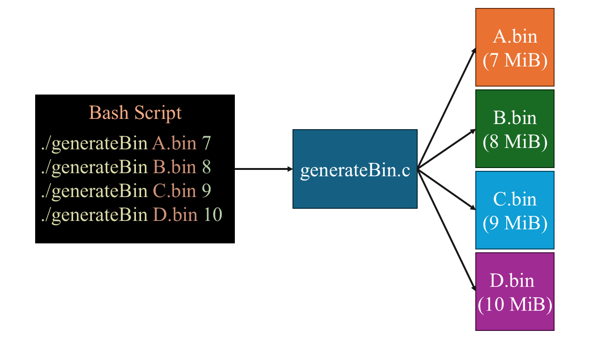
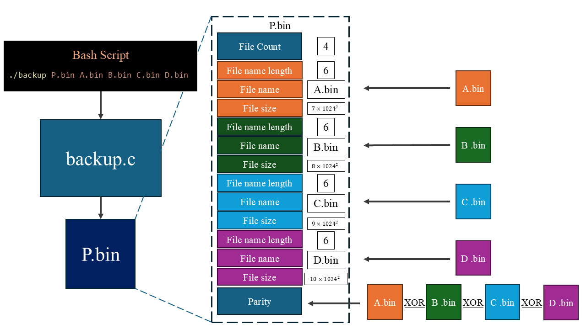
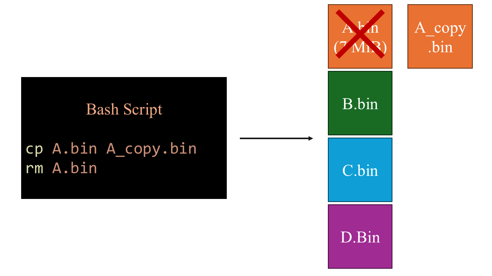
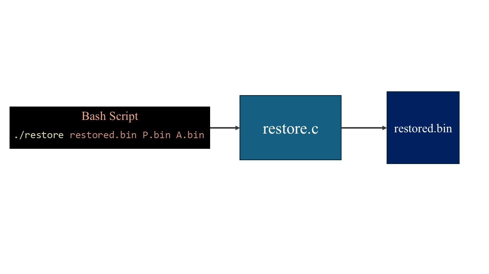

# file backup restore code
> this program can backup several files, and restore file when one file is broken.

1.	Generate four binary files (A.bin, B.bin, C.bin, D.bin) with sizes of 7, 8, 9, and 10 MiB respectively. Four binary files are for testing.

2.	A program in C/C++, named “backup”. Create a parity file (P.bin) from A.bin, B.bin, C.bin, and D.bin.

3.	Delete any one of the files generated in step 1.

4.	A program in C/C++, named “restore”, to recover the deleted file using P.bin and the remaining three files from step 1.

